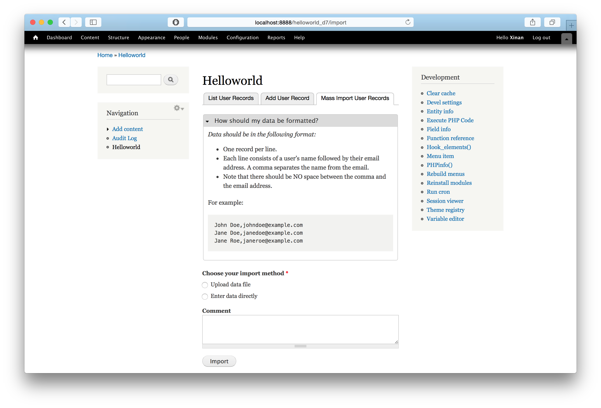

Helloworld (D7)
================

This is a drupal module for the 2014 CVWO assignment 2. 

* Name: Liu Xinan 
* Matric No.: A0130195M

### Dependencies 
* Drupal 7
* The common modules that comes with the assignment

### Installation
Put the helloworld_d7 folder into /sites/all/modules/[custom/], and then enable it from drupal's admin panels.

### Screenshot
 

### Short Write-Up
See [intro.pdf](intro.pdf)

### Database Dump and Live Site
I don't think there is a need for database dump and a live site. Just install this module (as well as the dependencies) into a Drupal 7 site and everything will work. 